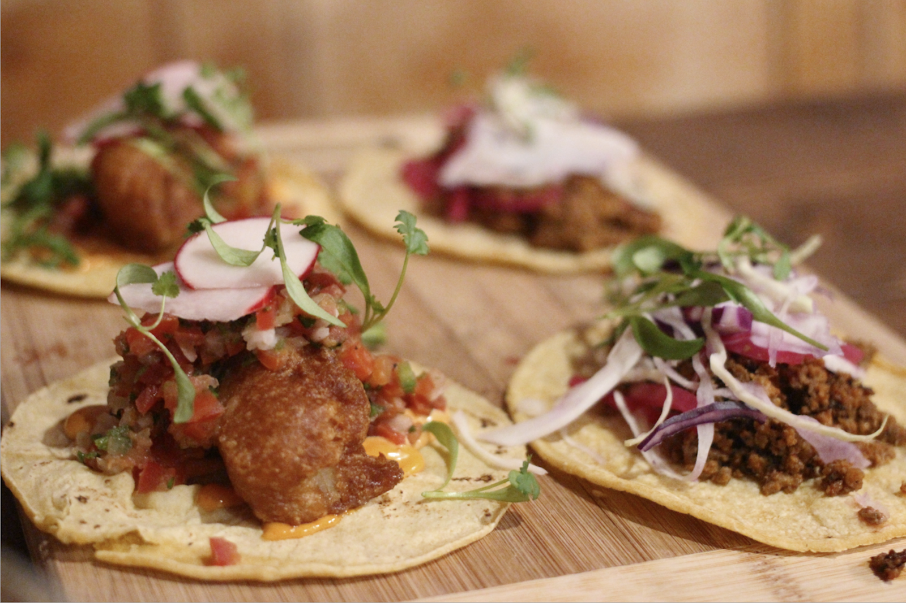

```{r child = "../../setup.Rmd"}
```

```{r load-packages, message=FALSE, echo=FALSE}
library(DiagrammeR)
library(magick)
library(tidyverse)
library(unvotes)
library(lubridate)
library(countdown)
library(openintro)
library(infer)
```

class: middle, inverse

## Imagine you’re new to baking, and you’re in a baking class. I’m going to present two options for starting the class. Which one gives you **better sense** of the final product?

---

background-image: url("img/cake-ingredients.png")
background-size: cover

>### Today we’re going to make a 
>### pineapple and coconut sandwich 
>### sponge cake with these ingredients

---

background-image: url("img/cake-result.png")
background-size: cover

>### Today we’re going to 
>### make a pineapple and 
>### coconut sandwich 
>### sponge cake with 
>### these ingredients

---

class: middle, inverse

## .hand[ OK, hold on to that thought! ]

---

class: middle

.pull-left-narrow[
  .huge-blue-number[2]
]
.pull-right-wide[
  .larger[
  design
  foundations
  ]
]

---

### .pink[ design foundation 1: ]

## backwards design

Set goals for educational curriculum before choosing instructional methods + forms of assessment

1. Identify desired results
1. Determine acceptable evidence
1. Plan learning experiences and instruction

.footnote[
Wiggins, Grant P., Grant Wiggins, and Jay McTighe. Understanding by design. Ascd, 2005.
]

---

## designing backwards

1. Identify desired **data analysis** results
1. Determine **building blocks**
1. Plan learning experiences and instruction

---

### .pink[ design foundation 2: ]

## 2016 Guidelines for Assessment and Instruction in Statistics Education (GAISE)

1. Teach statistical thinking.  
  - Teach statistics as an investigative process of problem-solving and decision making.
  - Give students experience with multivariable thinking [...] to answer challenging questions that require them to investigate and explore relationships among many variables.
1. Focus on conceptual understanding. 
1. Integrate real data with a context and purpose.
1. Foster active learning.
1. Use technology to explore concepts and analyse data.
1. Use assessments to improve and evaluate student learning. 

.footnote[
amstat.org/asa/files/pdfs/GAISE/GaiseCollege_Full.pdf
]

---

## 2016 GAISE

.pull-left-wide[
1. Teach **statistical thinking**.  
  - Teach statistics as an investigative process of problem-solving and decision making.
  - Give students experience with multivariable thinking [...] to answer challenging questions that require them to investigate and explore relationships among many variables.
1. Focus on conceptual understanding. 
1. Integrate real data with a context and purpose.
1. Foster active learning.
1. Use technology to explore concepts and analyse data.
1. Use assessments to improve and evaluate student learning.
]
.pull-right-narrow[
.hand-blue[
NOT a commonly used subset of tests and intervals and produce them with hand calculations
]
]

---

## 2016 GAISE

.pull-left-wide[
1. Teach statistical thinking.  
  - Teach statistics as an investigative process of problem-solving and decision making.
  - Give students experience with multivariable thinking [...] to answer challenging questions that require them to **investigate and explore relationships among many variables**.
1. Focus on conceptual understanding. 
1. Integrate real data with a context and purpose.
1. Foster active learning.
1. Use technology to explore concepts and analyse data.
1. Use assessments to improve and evaluate student learning.
]
.pull-right-narrow[
.hand-blue[
Multivariate analysis requires the use of computing
]
]

---

## 2016 GAISE

.pull-left-wide[
1. Teach statistical thinking.  
  - Teach statistics as an investigative process of problem-solving and decision making.
  - Give students experience with multivariable thinking [...] to answer challenging questions that require them to investigate and explore relationships among many variables.
1. Focus on conceptual understanding. 
1. Integrate real data with a context and purpose.
1. Foster active learning.
1. **Use technology** to explore concepts and analyse data.
1. Use assessments to improve and evaluate student learning.
]
.pull-right-narrow[
.hand-blue[
NOT use technology that is only applicable in the intro course or that doesn’t follow good science principles
]
]

---

## 2016 GAISE

.pull-left-wide[
1. Teach statistical thinking.  
  - Teach statistics as an investigative process of problem-solving and decision making.
  - Give students experience with multivariable thinking [...] to answer challenging questions that require them to investigate and explore relationships among many variables.
1. Focus on conceptual understanding. 
1. Integrate real data with a context and purpose.
1. Foster active learning.
1. Use technology to explore concepts and **analyse data**.
1. Use assessments to improve and evaluate student learning.
]
.pull-right-narrow[
.hand-blue[
Data analysis isn’t just inference and modelling, it’s also data importing, cleaning, preparation, exploration, and visualization
]
]

---

class: middle, inverse

## .hand[ So, where do we go with all this? ]

---

```{r topic-flow-diagram, echo=FALSE, out.width="100%", cache=TRUE}
topic_flow <- create_graph() %>%
  # Exploring data ----
  add_node(label = "Exploring\ndata", 
           node_aes = node_aes(x = 2, y = 2,
                               shape = "square", fixedsize = TRUE, height = 1, 
                               fontname = "helvetica", fontsize = 12, fontcolor = "black",
                               color = "#364E4F", penwidth = 2, fillcolor = "#BCECED")) %>%
  add_node(label = "Visualize", 
           node_aes = node_aes(x = 2, y = 3, 
                               fontsize = 10, width = 0.75,
                               color = "#BCECED", penwidth = 2, fillcolor = "white")) %>%
  add_node(label = "Wrangle", 
           node_aes = node_aes(x = 3, y = 1, 
                               fontsize = 10, width = 0.75,
                               color = "#BCECED", penwidth = 2, fillcolor = "white")) %>%
  add_node(label = "Import", 
           node_aes = node_aes(x = 1, y = 1, 
                               fontsize = 10, width = 0.75,
                               color = "#BCECED", penwidth = 2, fillcolor = "white")) %>%
  add_edge(from = "Visualize", to = "Exploring\ndata", edge_aes = edge_aes(arrowhead = "none")) %>%
  add_edge(from = "Wrangle", to = "Exploring\ndata", edge_aes = edge_aes(arrowhead = "none")) %>%
  add_edge(from = "Import", to = "Exploring\ndata", edge_aes = edge_aes(arrowhead = "none")) %>%
  # Making rigorous conclusions ----
  add_node(label = "Making\nrigorous\nconclusions", 
           node_aes = node_aes(x = 5, y = 2,
                               shape = "square", fixedsize = TRUE, height = 1, 
                               fontsize = 12, fontcolor = "black",
                               color = "#5581B0", penwidth = 2, fillcolor = "#B6D7E4")) %>%
  add_edge(from = "Exploring\ndata", to = "Making\nrigorous\nconclusions",
           edge_aes = edge_aes(arrowhead = "normal")) %>%
  add_edge(from = "Making\nrigorous\nconclusions", to = "Exploring\ndata",
           edge_aes = edge_aes(arrowhead = "normal")) %>%
  add_node(label = "Model", 
           node_aes = node_aes(x = 4, y = 3, 
                               fontsize = 10, width = 0.75,
                               color = "#B6D7E4", penwidth = 2, fillcolor = "white")) %>%
  add_node(label = "Predict", 
           node_aes = node_aes(x = 6, y = 3, 
                               fontsize = 10, width = 0.75,
                               color = "#B6D7E4", penwidth = 2, fillcolor = "white")) %>%
  add_node(label = "Infer", 
           node_aes = node_aes(x = 5, y = 1, 
                               fontsize = 10, width = 0.75,
                               color = "#B6D7E4", penwidth = 2, fillcolor = "white")) %>%
  add_edge(from = "Model", to = "Making\nrigorous\nconclusions", edge_aes = edge_aes(arrowhead = "none")) %>%
  add_edge(from = "Predict", to = "Making\nrigorous\nconclusions", edge_aes = edge_aes(arrowhead = "none")) %>%
  add_edge(from = "Infer", to = "Making\nrigorous\nconclusions", edge_aes = edge_aes(arrowhead = "none")) %>%
  # Looking further ----
  add_node(label = "Looking\nfurther", 
           node_aes = node_aes(x = 8, y = 2,
                               shape = "square", fixedsize = TRUE, height = 1, 
                               fontname = "helvetica", fontsize = 12, fontcolor = "black",
                               color = "#737F7E", penwidth = 2, fillcolor = "#F9F9F9")) %>%
  add_edge(from = "Making\nrigorous\nconclusions", to = "Looking\nfurther",
           edge_aes = edge_aes(arrowhead = "normal")) %>%
  add_edge(to = "Making\nrigorous\nconclusions", from = "Looking\nfurther",
           edge_aes = edge_aes(arrowhead = "normal"))

diagram <- render_graph(topic_flow)
# to place diagram properly on slide: 
# https://github.com/yihui/xaringan/issues/144
widgetframe::frameWidget(diagram, height = "60%")
```

.midi[
  .four-column[fundamentals of data & data viz, confounding, Simpson’s paradox + R / RStudio, R Markdown, simple Git]
  .four-column[tidy data, data frames vs. summary tables, recoding & transforming, web scraping & iteration + collaboration on GitHub]
  .four-column[building & selecting models, visualising interactions, prediction & validation, inference via simulation]
  .four-column[data science ethics, text analysis / Shiny / Bayesian inference / ... + communication & dissemination]
]

---

.discussion[
Discuss in groups of three and then as a large group.

- What are your first reactions to the curriculum we just described for an intro data science course? 
- Which components can you see yourself (or do you already) include in an intro data science curriculum?
- Which components do you have reservations about, and why?
]

```{r echo=FALSE}
countdown(minutes = 3)
```


---

.pull-left-narrow[
  .huge-blue-number[5]
]
.pull-right-wide[
  .larger[
  design
  principles
  ]
]

---

class: middle, inverse

## Which kitchen would you rather bake in? 

.pull-left[
```{r kitchen-inrepair, echo=FALSE}
knitr::include_graphics("img/kitchen-inrepair.png")
```
]
.pull-right[
```{r kitchen-built, echo=FALSE}
knitr::include_graphics("img/kitchen-built.png")
```
]

---

class: middle, inverse

## Which kitchen would you rather bake in?

.pull-left[
```{r kitchen-inrepair-xed, echo=FALSE, cache=TRUE}
image_read("img/kitchen-inrepair.png") %>%
  image_annotate("X", size = 1200, gravity = "Center", color = "#638CC7")
```
]
.pull-right[
```{r kitchen-built-selected, echo=FALSE, cache=TRUE}
image_read("img/kitchen-built.png") %>% 
  image_border("#F5B895", "50x50") %>%
  image_annotate("\u2665", size = 300, gravity = "SouthEast", color = "#F5B895", location = "+100+50")
```
]

---

.pull-left-wide[
  .right[
  .larger[
  cherish  
  day  
  one  
  ]  
  ]
]
.pull-right-narrow[
  .huge-pink-number[1]
]

---

.pull-left[
```{r kitchen-inrepair-small, echo=FALSE, out.height=250}
knitr::include_graphics("img/kitchen-inrepair.png")
```
- Install R
- Install RStudio
- Install the following packages:
  - tidyverse
  - rmarkdown
  - ...
- Load these packages
- Install git
]
.pull-right[
```{r kitchen-built-small, echo=FALSE, out.height=250}
knitr::include_graphics("img/kitchen-built.png")
```
- Go to rstudio.cloud (or some other server based solution)
- Log in with your ID & pass
```{r hello-R, eval=FALSE}
> hello R!
```
]

---

class: middle, center

[minecr.shinyapps.io/unvotes](https://minecr.shinyapps.io/unvotes/)

[`r knitr::include_graphics("img/unvotes-app.png")`](https://minecr.shinyapps.io/unvotes/)

---

class: middle, center

<iframe width="1200" height="630" src="https://www.youtube.com/embed/2ka00b9A0TA" frameborder="0" allow="accelerometer; autoplay; encrypted-media; gyroscope; picture-in-picture" allowfullscreen></iframe>

---

.your-turn[
- Go to [rstd.io/design-ds-cloud](https://rstd.io/design-ds-cloud) to join the RStudio Cloud workspace for this workshop
- Start the **assignment** called **01 - Curriculum Design**
- Open the R Markdown document called `un-votes.Rmd`, knit the document, view the result
- Then, change "Turkey" to another country, and knit again.
- When you're done with the exercise, discuss with your neighbours: 
  - What worked? What didn't? 
  - What would you add to the instructions? What would you take away?
]

```{r echo=FALSE}
countdown(minutes = 5)
```


---

class: middle, inverse

## How do you prefer your cake recipes? Words only, or words & pictures?

.pull-left[
```{r recipe-picture, echo=FALSE}
knitr::include_graphics("img/recipe-picture.png")
```
]
.pull-right[
```{r recipe-words, echo=FALSE}

```
]

---

class: middle, inverse

## How do you prefer your cake recipes? Words only, or words & pictures?

.pull-left[
```{r recipe-picture-selected, echo=FALSE, cache=TRUE}
image_read("img/recipe-picture.png") %>%
  image_border("#F5B895", "50x50") %>%
  image_annotate("\u2665", size = 300, gravity = "SouthEast", color = "#F5B895", location = "+100+50")
```
]
.pull-right[
```{r recipe-words-xed, echo=FALSE, cache=TRUE}
image_read("img/recipe-words.png") %>%
  image_annotate("X", size = 1200, gravity = "Center", color = "#638CC7")
```
]

---

.pull-left-wide[
  .right[
  .larger[
  start  
  with  
  cake  
  ]  
  ]
]
.pull-right-narrow[
  .huge-pink-number[2]
]

---

.pull-left[
```{r recipe-picture-small, echo=FALSE, out.height=150, out.width=250, fig.align="center"}
knitr::include_graphics("img/recipe-picture.png")
```
- Open today's demo project
- Knit the document and discuss the visualisation you made with your neighbor
- Then, change `Turkey` to a different country, and plot again
]
.pull-right[
```{r recipe-words-small, echo=FALSE, out.height=150, out.width=250, fig.align="center"}

```
.small[
```{r recipe-words-code}
x <- 8
y <- "monkey"
z <- FALSE

class(x)
class(y)
class(z)
```
]
]

---

class: middle

## .hand[ with with great examples, ]
## .hand[ comes a great amount of code... ]

---

class: middle

## .hand[ but let’s focus on the task at hand... ]

- Open today's demo project
- Knit the document and discuss the visualisation you made with your neighbor
- Then, **.pink[ change `Turkey` to a different country, and plot again]**

---

.small[
```{r unvotes-code-1, eval=FALSE}
un_votes %>%
  filter(country %in% c("United States of America", "Turkey")) %>%
  inner_join(un_roll_calls, by = "rcid") %>%
  inner_join(un_roll_call_issues, by = "rcid") %>%
  mutate(issue = ifelse(issue == "Nuclear weapons and nuclear material",
                        "Nuclear weapons and materials", issue)) %>%
  group_by(country, year = year(date), issue) %>%
  summarize(
    votes = n(),
    percent_yes = mean(vote == "yes")
    ) %>%
  filter(votes > 5) %>%
  ggplot(mapping = aes(x = year, y = percent_yes, color = country)) +
    geom_point() +
    geom_smooth(method = "loess", se = FALSE) +
    facet_wrap(~ issue) +
    labs(
      title = "Percentage of Yes votes in the UN General Assembly",
      subtitle = "1946 to 2015",
      y = "% Yes",
      x = "Year",
      color = "Country"
    )
```
]

---

.midi[
```{r unvotes-code-2, eval=FALSE}
un_votes %>%
  filter(country %in% c("United States of America", "Turkey")) %>% #<<
  inner_join(un_roll_calls, by = "rcid") %>%
  inner_join(un_roll_call_issues, by = "rcid") %>%
  group_by(country, year = year(date), issue) %>%
  summarize(
    votes = n(),
    perc_yes = mean(vote == "yes")
    ) %>%
  filter(votes > 5) %>%
  ggplot(mapping = aes(x = year, y = perc_yes, color = country)) +
    geom_point() +
    geom_smooth(method = "loess", se = FALSE) +
    facet_wrap(~ issue) +
    labs(
      title = "Percentage of Yes votes in the UN General Assembly",
      subtitle = "1946 to 2015",
      y = "% Yes", x = "Year", color = "Country"
    )
```
]

---

.midi[
```{r unvotes-code-3, eval=FALSE}
un_votes %>%
  filter(country %in% c("United States of America", "France")) %>% #<<
  inner_join(un_roll_calls, by = "rcid") %>%
  inner_join(un_roll_call_issues, by = "rcid") %>%
  group_by(country, year = year(date), issue) %>%
  summarize(
    votes = n(),
    perc_yes = mean(vote == "yes")
    ) %>%
  filter(votes > 5) %>%
  ggplot(mapping = aes(x = year, y = perc_yes, color = country)) +
    geom_point() +
    geom_smooth(method = "loess", se = FALSE) +
    facet_wrap(~ issue) +
    labs(
      title = "Percentage of Yes votes in the UN General Assembly",
      subtitle = "1946 to 2015",
      y = "% Yes", x = "Year", color = "Country"
    )
```
]

---

.your-turn[
### 01 - Curriculum design / `start-with-cake.Rmd`

- Your challenge is to go from nothing to a data visualisation in 15 minutes of your first class. Don't worry about the computing infrastructure (we'll get to that later in the day), assume students have successfully landed in RStudio Cloud like you did earlier. Design an exercise for them to "create" their first visualisation.
- If you need inspiration, you can use the `ggplot2::diamonds` or `dplyr::starwars` dataset or any dataset from `nycflights13` or `gapminder` packages.
- If you already have a first day exercise you like, you're welcomed to modify it to fit the challenge: from nothing to a data visualisation in 15 minutes!
- Compare notes with neighbors. 
]

```{r echo=FALSE}
countdown(minutes = 5)
```

---

class: middle, inverse

## Which motivates you more to learn how to cook: perfectly chopped onions or ratatouille?

.pull-left[
```{r chop-onions, echo=FALSE}
knitr::include_graphics("img/chop-onions.png")
```
]
.pull-right[
```{r make-ratatouille, echo=FALSE}

```
]

---

class: middle, inverse

## Which motivates you more to learn how to cook: perfectly chopped onions or ratatouille?

.pull-left[
```{r chop-onions-xed, echo=FALSE, cache=TRUE}
image_read("img/chop-onions.png") %>%
  image_annotate("X", size = 1200, gravity = "Center", color = "#638CC7")
```
]
.pull-right[
```{r make-ratatouille-selected, echo=FALSE, cache=TRUE}
image_read("img/make-ratatouille.png") %>%
  image_border("#F5B895", "50x50") %>%
  image_annotate("\u2665", size = 300, gravity = "SouthEast", color = "#F5B895", location = "+100+50")
```
]

---

.pull-left-wide[
  .right[
  .larger[
  skip  
  baby  
  steps  
  ]  
  ]
]
.pull-right-narrow[
  .huge-pink-number[3]
]

---

.pull-left[
```{r chop-onions-small, echo=FALSE, out.height=150, out.width=250, fig.align="center"}
knitr::include_graphics("img/chop-onions.png")
```
```{r unvotes-univariate, echo=FALSE, warning=FALSE}
ggplot(un_roll_calls, aes(x = amend)) +
  geom_bar()
```
]
.pull-right[
```{r make-ratatouille-small, echo=FALSE, out.height=150, out.width=250, fig.align="center"}

```
.small[
```{r unvotes-multivariate, echo=FALSE, fig.height=5}
un_votes %>%
  filter(country %in% c("United States of America")) %>%
  inner_join(un_roll_calls, by = "rcid") %>%
  inner_join(un_roll_call_issues, by = "rcid") %>%
  mutate(
    importantvote = ifelse(importantvote == 0, "No", "Yes"),
    issue = ifelse(issue == "Nuclear weapons and nuclear material", "Nuclear weapons and materials", issue)
    ) %>%
  ggplot(aes(x = importantvote, fill = vote)) +
  geom_bar(position = "fill") +
  facet_wrap(~ issue, ncol = 1) +
  labs(
    title = "How the US voted in the UN",
    subtitle = "By issue and importance of vote",
    x = "Important vote", y = "", fill = "Vote"
  ) +
  coord_flip() +
  theme_minimal() +
  scale_fill_viridis_d(option = "E")
```
]
]

---

class: middle

## .hand[ non-trivial examples can be motivating, ]
## .hand[ but need to avoid ] `r emo::ji("point_down")`

.pull-left[
```{r owl-1, echo=FALSE, fig.align="right", out.height=390, out.width=250}
knitr::include_graphics("img/owl-step1.png")
```
]
.pull-right[
```{r owl-2, echo=FALSE, fig.align="left", out.height=390, out.width=250}
knitr::include_graphics("img/owl-step2.png")
```
]

---

class: middle

.center[
.three-column[
```{r ref.label="owl-1", echo=FALSE, out.height=400, out.width=250}
```
]
.three-column[
## .center[ .hand[ scaffold + layer ] ]
]
.three-column[
```{r ref.label="owl-2", echo=FALSE, out.height=400, out.width=250}
```
]
]

---

.your-turn[
### 01 - Curriculum design / `hide-show.Rmd`

The following code is used to create the multivariate visualisation we saw earlier. How much of the code would you show/hide when just starting teaching ggplot2?
]

.tiny[
```{r unvotes-multivariate-code, eval=FALSE}
un_votes %>%
  filter(country %in% c("United States of America")) %>%
  inner_join(un_roll_calls, by = "rcid") %>%
  inner_join(un_roll_call_issues, by = "rcid") %>%
  mutate(
    importantvote = ifelse(importantvote == 0, "No", "Yes"),
    issue = ifelse(issue == "Nuclear weapons and nuclear material", "Nuclear weapons and materials", issue)
    ) %>%
  ggplot(aes(x = importantvote, fill = vote)) +
  geom_bar(position = "fill") +
  facet_wrap(~ issue, ncol = 1) +
  labs(
    title = "How the US voted in the UN", 
    subtitle = "By issue and importance of vote",
    x = "Important vote", y = "", fill = "Vote"
    ) +
  coord_flip() +
  theme_minimal() +
  scale_fill_viridis_d(option = "E")
```
]

```{r echo=FALSE}
countdown(minutes = 5)
```

---

## Designing code snippets for teaching

- Write it out to your heart's desire and polish it

--

- Then, split into three parts:
  - `r emo::ji("package")` **Pre-process:** Required, but isn't directly connected to / far off from learning goals of current lesson
  - `r emo::ji("broken_heart")` **Stash:** Not required, and not directly connected to learning goals of current lesson 
    - Likely concepts that fit better into future lessons)
  - `r emo::ji("white_check_mark")` **Feature:** Heart of the lesson (and maybe a review of a previous lessons)
  
- Finally, decide on the pace at which to scaffold and layer

---

## `r emo::ji("package")` Pre-process

We'll call the highlighted lines `us_votes`

.small[
```{r preprocess, eval=FALSE}
un_votes %>% #<<
  filter(country %in% c("United States of America")) %>% #<<
  inner_join(un_roll_calls, by = "rcid") %>% #<<
  inner_join(un_roll_call_issues, by = "rcid") %>% #<<
  mutate( #<<
    importantvote = ifelse(importantvote == 0, "No", "Yes"), #<<
    issue = ifelse(issue == "Nuclear weapons and nuclear material", "Nuclear weapons and materials", issue) #<<
    ) %>% #<<
  ggplot(aes(x = importantvote, fill = vote)) +
  geom_bar(position = "fill") +
  facet_wrap(~ issue, ncol = 1) +
  labs(
    title = "How the US voted in the UN", 
    subtitle = "By issue and importance of vote",
    x = "Important vote", y = "", fill = "Vote"
    ) +
  coord_flip() +
  theme_minimal() +
  scale_fill_viridis_d(option = "E")
```
]

---

```{r preprocess-eval, echo=FALSE}
us_votes <- un_votes %>%
  filter(country %in% c("United States of America")) %>%
  inner_join(un_roll_calls, by = "rcid") %>%
  inner_join(un_roll_call_issues, by = "rcid") %>%
  mutate(
    importantvote = ifelse(importantvote == 0, "No", "Yes"),
    issue = ifelse(issue == "Nuclear weapons and nuclear material", "Nuclear weapons and materials", issue)
    )
```

.small[
```{r}
us_votes
```
]

---

## `r emo::ji("broken_heart")` **Stash:**

.small[
```{r stash, eval=FALSE}
un_votes %>%
  filter(country %in% c("United States of America")) %>%
  inner_join(un_roll_calls, by = "rcid") %>%
  inner_join(un_roll_call_issues, by = "rcid") %>%
  mutate(
    importantvote = ifelse(importantvote == 0, "No", "Yes"),
    issue = ifelse(issue == "Nuclear weapons and nuclear material", "Nuclear weapons and materials", issue)
    ) %>%
  ggplot(aes(x = importantvote, fill = vote)) +
  geom_bar(position = "fill") +
  facet_wrap(~ issue, ncol = 1) +
  labs(
    title = "How the US voted in the UN", 
    subtitle = "By issue and importance of vote",
    x = "Important vote", y = "", fill = "Vote"
    ) +
  coord_flip() +
  theme_minimal() + #<<
  scale_fill_viridis_d(option = "E") #<<
```
]

---

## `r emo::ji("white_check_mark")` Feature

```{r feature, eval=FALSE}
us_votes %>%
  ggplot(aes(x = importantvote, fill = vote)) +
  geom_bar(position = "fill") +
  facet_wrap(~ issue, ncol = 1) +
  labs(
    title = "How the US voted in the UN", 
    subtitle = "By issue and importance of vote",
    x = "Important vote", y = "", fill = "Vote"
    ) +
  coord_flip()
```

---

.pull-left[
```{r scaffold-layer-1, eval=FALSE}
ggplot(data = us_votes) #<<
```
]
.pull-right[
```{r ref.label="scaffold-layer-1", echo=FALSE}
```
]

---

.pull-left[
.small[
```{r scaffold-layer-2, eval=FALSE}
ggplot(data = us_votes, 
  mapping = aes(x = importantvote, #<<
                fill = vote)) #<<
```
]
]
.pull-right[
```{r ref.label="scaffold-layer-2", echo=FALSE}
```
]

---

.pull-left[
.small[
```{r scaffold-layer-3, eval=FALSE}
ggplot(data = us_votes, 
  mapping = aes(x = importantvote, 
                fill = vote)) +
  geom_bar(position = "fill") #<<
```
]
]
.pull-right[
```{r ref.label="scaffold-layer-3", echo=FALSE}
```
]

---

.pull-left[
.small[
```{r scaffold-layer-4, eval=FALSE}
ggplot(data = us_votes, 
  mapping = aes(x = importantvote, 
                fill = vote)) +
  geom_bar(position = "fill") +
  facet_wrap(~ issue, ncol = 1) #<<
```
]
]
.pull-right[
```{r ref.label="scaffold-layer-4", echo=FALSE, fig.height=5.8}
```
]

---

.pull-left[
.small[
```{r scaffold-layer-5, eval=FALSE}
ggplot(data = us_votes, 
  mapping = aes(x = importantvote, 
                fill = vote)) +
  geom_bar(position = "fill") +
  facet_wrap(~ issue, ncol = 1) +
  labs( #<<
    title = "How the US voted in the UN", #<<
    subtitle = "By issue and importance of vote", #<<
    x = "Important vote", #<<
    y = "" #<<
    ) #<<
```
]
]
.pull-right[
```{r ref.label="scaffold-layer-5", echo=FALSE, fig.height=5.8}
```
]

---

.pull-left[
.small[
```{r scaffold-layer-6, eval=FALSE}
ggplot(data = us_votes, 
  mapping = aes(x = importantvote, 
                fill = vote)) +
  geom_bar(position = "fill") +
  facet_wrap(~ issue, ncol = 1) +
  labs(
    title = "How the US voted in the UN",
    subtitle = "By issue and importance of vote",
    x = "Important vote",
    y = "",
    fill = "Vote" #<<
    ) 
```
]
]
.pull-right[
```{r ref.label="scaffold-layer-6", echo=FALSE, fig.height=5.8}
```
]

---

.pull-left[
.small[
```{r scaffold-layer-7, eval=FALSE}
ggplot(data = us_votes, 
  mapping = aes(x = importantvote, 
                fill = vote)) +
  geom_bar(position = "fill") +
  facet_wrap(~ issue, ncol = 1) +
  labs(
    title = "How the US voted in the UN", 
    subtitle = "By issue and importance of vote",
    x = "Important vote", 
    y = "", 
    fill = "Vote"
    ) +
  coord_flip() #<<
```
]
]
.pull-right[
```{r ref.label="scaffold-layer-7", echo=FALSE, fig.height=7}
```
]

---

## ~~Skip~~ Re-insert baby steps

```{r echo=FALSE}
knitr::include_graphics("img/learnr-visualise.png")
```

---

class: middle, inverse

## Which is more likely to appeal to someone who has never tried broccoli?

.pull-left[
```{r broccoli-raw, echo=FALSE}
knitr::include_graphics("img/broccoli-raw.png")
```
]
.pull-right[
```{r broccoli-cooked, echo=FALSE}

```
]

---

class: middle, inverse

## Which is more likely to appeal to someone who has never tried broccoli?

.pull-left[
```{r broccoli-raw-xed, echo=FALSE, cache=TRUE}
image_read("img/broccoli-raw.png") %>%
  image_annotate("X", size = 1200, gravity = "Center", color = "#638CC7")
```
]
.pull-right[
```{r broccoli-cooked-selected, echo=FALSE, cache=TRUE}
image_read("img/broccoli-cooked.png") %>%
  image_border("#F5B895", "50x50") %>%
  image_annotate("\u2665", size = 300, gravity = "SouthEast", color = "#F5B895", location = "+100+50")
```
]

---

.pull-left-wide[
  .right[
  .larger[
  hide  
  the  
  veggies  
  ]  
  ]
]
.pull-right-narrow[
  .huge-pink-number[4]
]

---

.pull-left-narrow[
```{r broccoli-raw-small, echo=FALSE, out.height=150, out.width=250, fig.align="center"}
knitr::include_graphics("img/broccoli-raw.png")
```

Today we're going to do web scraping
- Using the **rvest** package
- And with the help of *regular expressions*
]
.pull-right-wide[
```{r broccoli-cooked-small, echo=FALSE, out.height=150, out.width=250, fig.align="center"}

```

- Today we go from this to that
```{r echo=FALSE}
knitr::include_graphics("img/open-secrets-nc.png")
```
- and do so in a way that is easy to replicate for another state
]

---

class: middle

## .hand[ students will encounter lots of ]
## .hand[ new challenges along the way -- ]
## .hand[ let that happen, ]
## .hand[ and then provide a solution ]

---

## Start with a mini-lecture

- **Lesson:** Web scraping essentials for turning a structured table into a data frame in R.

---

## Follow up with a hands-on exercise

- **Lesson:** Web scraping essentials for turning a structured table into a data frame in R.
- **Ex 1:** Scrape the table off the web and save as a data frame.

```{r open-secrets-nc-ex1, echo=FALSE, out.width="70%", fig.align="center"}
knitr::include_graphics("img/open-secrets-nc-ex1.png")
```

---

## And a thought exercise

- **Lesson:** Web scraping essentials for turning a structured table into a data frame in R.
- **Ex 1:** Scrape the table off the web and save as a data frame.
- **Ex 2:** What other information do we need represented as variables in the data to obtain the desired facets? 

```{r open-secrets-nc-ex2, echo=FALSE, out.width="50%", fig.align="center"}

```

---


## And finally, the veggies!

- **Lesson:** Web scraping essentials for turning a structured table into a data frame in R.
- **Ex 1:** Scrape the table off the web and save as a data frame.
- **Ex 2:** What other information do we need represented as variables in the data to obtain the desired facets? 
- **Lesson:** “Just enough” string parsing and regular expressions to go from

```{r open-secrets-nc-ex3, echo=FALSE, out.width="100%"}
knitr::include_graphics("img/open-secrets-nc-ex3.png")
```

---

class: middle, inverse

## If you are already taking a baking class, which will be easier to venture on to?

.pull-left[
```{r make-pastries, echo=FALSE}
knitr::include_graphics("img/make-pastries.png")
```
]
.pull-right[
```{r make-tacos, echo=FALSE}

```
]

---

class: middle, inverse

## If you are already taking a baking class, which will be easier to venture on to?

.pull-left[
```{r make-pastries-selected, echo=FALSE, cache=TRUE}
image_read("img/make-pastries.png") %>%
  image_border("#F5B895", "50x50") %>%
  image_annotate("\u2665", size = 300, gravity = "SouthEast", color = "#F5B895", location = "+100+50")
```
]
.pull-right[
```{r make-tacos-xed, echo=FALSE, cache=TRUE}
image_read("img/make-tacos.png") %>%
  image_annotate("X", size = 1200, gravity = "Center", color = "#638CC7")
```
]

---

.pull-left-wide[
  .right[
  .larger[
  leverage  
  the  
  ecosystem  
  ]  
  ]
]
.pull-right-narrow[
  .huge-pink-number[5]
]

---

## Suppose...

Estimate the difference between the average evaluation score of male and female faculty.

```{r echo=FALSE}
evals %>%
  select(score, rank, ethnicity, gender, bty_avg)
```

---

.pull-left[
```{r make-pastries-small, echo=FALSE, out.height=150, out.width=250, fig.align="center"}
knitr::include_graphics("img/make-pastries.png")
```
.small[
```{r cache=TRUE}
evals %>%
  specify(score ~ gender) %>%
  generate(reps = 1000, 
    type = "bootstrap") %>%
  calculate(stat = "diff in means", 
    order = c("male", "female")) %>%
  summarise(
    l = quantile(stat, 0.025), 
    u = quantile(stat, 0.975)
    )
```
]
]
.pull-right[
```{r make-tacos-small, echo=FALSE, out.height=150, out.width=250, fig.align="center"}

```
.small[
```{r}
t.test(evals$score ~ evals$gender)
```
]
]

---

## infer $\in$ tidymodels

.pull-left-wide[
The objective of this package is to perform statistical inference using an expressive statistical grammar that coheres with the tidyverse design framework.
]
.pull-right-narrow[
```{r echo=FALSE}
knitr::include_graphics("img/infer-hex.png")
```
]

---

```{r infer-1}
evals %>%
  specify(score ~ gender)
```

---

```{r infer-2, cache=TRUE}
set.seed(1234)
evals %>%
  specify(score ~ gender) %>%
  generate(reps = 1000, type = "bootstrap")
```

---

```{r infer-3, cache=TRUE}
set.seed(1234)
evals %>%
  specify(score ~ gender) %>%
  generate(reps = 1000, type = "bootstrap") %>%
  calculate(stat = "diff in means", order = c("male", "female"))
```

---

```{r infer-4, cache=TRUE, fig.height=2}
set.seed(1234)
evals %>%
  specify(score ~ gender) %>%
  generate(reps = 1000, type = "bootstrap") %>%
  calculate(stat = "diff in means", order = c("male", "female")) %>%
  visualise()
```

---

```{r infer-5, cache=TRUE}
set.seed(1234)
evals %>%
  specify(score ~ gender) %>%
  generate(reps = 1000, type = "bootstrap") %>%
  calculate(stat = "diff in means", order = c("male", "female")) %>%
  summarise(l = quantile(stat, 0.025), u = quantile(stat, 0.975))
```

---

## One other way to "leverage the ecosystem"

Do it all in R!

- Slides with **xaringan**
- Course website with **blogdown**
- Course notes / textbook with **bookdown**
- A student dashboard with **flexdashboard**
- Git automation with **ghclass**
- Interactive tutorials with **learnr**
- ...

---

class: middle

.your-turn[
Take one minute to write down one concrete change you'd like to consider making in your teaching based on what we've covered in this module.
]

