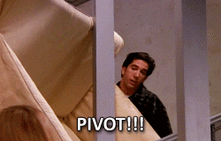

```{r child = "../../setup.Rmd"}
```

```{r load-packages, message=FALSE, echo=FALSE}
library(tidyverse)
library(broom)
library(scales)
library(openintro)
library(jsonlite)
```

class: middle, inverse

# What, why, how?

---

class: middle

# What is the tidyverse?

---

## What is the tidyverse?

The tidyverse is an opinionated collection of R packages designed for data science. All packages share an underlying design philosophy, grammar, and data structures.

- **ggplot2** - data visualisation
- **dplyr** - data manipulation
- **tidyr** - tidy data
- **readr** - read rectangular data
- **purrr** - functional programming
- **tibble** - modern data frames
- **stringr** - string manipulation
- **forcats** - factors

---

## Tidyverse references

.pull-left[
```{r echo=FALSE}
knitr::include_graphics("img/tidy-papers.png")
```
]
.pull-right[
- Wickham, H. (2014). **Tidy data.** Journal of Statistical Software, 59(10), 1-23.
- Wickham, H., Averick, M., Bryan, J., Chang, W., McGowan, L., François, R., ... & Kuhn, M. (2019). **Welcome to the Tidyverse.** Journal of Open Source Software, 4(43), 1686.
]

---

class: middle, center

# Why tidyverse?

---

## Recoding a binary variable

.pull-left[
### Base R
```{r}
mtcars$transmission <-
  ifelse(mtcars$am == 0,
         "automatic",
         "manual")
```
]
.pull-right[
### Tidyverse
```{r}
mtcars <- mtcars %>%
  mutate(
    transmission =
      case_when(
    am == 0 ~ "automatic",
    am == 1 ~ "manual"
    )
  )
```
]
---

## Recoding a multi-level variable

.pull-left[
### Base R
```{r}
mtcars$gear_char <-
  ifelse(mtcars$gear == 3,
    "three",
    ifelse(mtcars$gear == 4,
      "four",
      "five"))
```
]
.pull-right[
### Tidyverse
```{r}
mtcars <- mtcars %>%
  mutate(
    gear_char =
      case_when(
    gear == 3 ~ "three",
    gear == 4 ~ "four",
    gear == 5 ~ "five"
    )
  )
```
]

---

## Visualising multiple variables

### Base R

.small[
```{r fig.height=1.5}
mtcars$trans_color <- ifelse(mtcars$transmission == "automatic",
                             "green", "blue")
par(mar=c(0,0,0,0))
plot(mtcars$mpg ~ mtcars$disp, col = mtcars$trans_color)
legend("topright",
       legend = c("automatic", "manual"),
       pch = 1, col = c("green", "blue"))
```
]

---

## Visualising multiple variables

### Tidyverse

```{r fig.height=1.7}
ggplot(mtcars,
       aes(x = disp, y = mpg,
           color = transmission)) +
  geom_point()
```

---

## Visualising even more variables

### Base R

.small[
```{r fig.height=1.2}
mtcars_cyl4 = mtcars[mtcars$cyl == 4, ]
mtcars_cyl6 = mtcars[mtcars$cyl == 6, ]
mtcars_cyl8 = mtcars[mtcars$cyl == 8, ]
par(mfrow = c(1, 3), mar = c(2,2,2,0.5))
plot(mpg ~ disp, data = mtcars_cyl4, col = trans_color, main = "Cyl 4")
plot(mpg ~ disp, data = mtcars_cyl6, col = trans_color, main = "Cyl 6")
plot(mpg ~ disp, data = mtcars_cyl8, col = trans_color, main = "Cyl 8")
legend("topright", legend = c("automatic", "manual"),
       pch = 1, col = c("green", "blue"))
```
]

---

## Visualising even more variables

### Tidyverse

```{r fig.height=1.5}
ggplot(mtcars,
       aes(x = disp, y = mpg,
           color = transmission)) +
  geom_point() +
  facet_wrap(~ cyl)
```

---

## Benefits of starting with the tidyverse

- (Closer to) human readable
- Consistent syntax
- Ease of multivariate visualizations
- Growth opportunities:
  - dplyr -> SQL
  - purrr -> functional programming

---

.discussion[
- What are other arguments for starting to teach R with the tidyverse?
- Any arguments against it?
]

---

class: middle

# How tidyverse?

---

.discussion[
How do you start your lessons? Why?
- `library(tidyverse)` 
- `library(ggplot2)`, `library(dplyr)`, etc.
]

---

### .pink[ Sample slide ]

## ggplot2 $\in$ tidyverse

.pull-left[
```{r echo=FALSE, out.width="80%"}
knitr::include_graphics("img/ggplot2-part-of-tidyverse.png")
```
]
.pull-right[
- **ggplot2** is tidyverse's data visualization package
- The `gg` in "ggplot2" stands for Grammar of Graphics
- It is inspired by the book **Grammar of Graphics** by Leland Wilkinson
]

---

class: middle

# Start with ggplot2

---

## Why start with ggplot2?

1. Students come in with intutition for being able to interpret data visualizations without needing much instructions. 
  - Focus the majority of class time initially on R syntax and leave interpretations to students. 
  - Later on the scale tips -- spend more class time on concepts and results interpretations and less on R syntax.

1. It can be easier for students to detect mistakes in visualisations compared to those in data wrangling or statistical modeling. 
  
---

**Ex 1. It can be more difficult, especially for a new learner, to catch errors in data wrangling than in a data visualisation.**

Suppose we want to find the average mileage of cars with more than 100 horsepower.

- Left: Incorrect because `hp` is numeric, so no filtering is done, but also no error is given.
- Right: Correct, and note that reported mean is different.

.pull-left[
```{r wrong-filter, echo=TRUE, size = "small"}
mtcars %>%
  filter(hp > "100") %>%
  summarise(mean(mpg))
```
]
.pull-right[
```{r right-filter, echo=TRUE, size = "small"}
mtcars %>%
  filter(hp > 100) %>%
  summarise(mean(mpg))
```
]

---

**Ex 2. It can be difficult to catch modeling errors, again especially for new learners.** 

Fit a model predicting gas efficiency (`mpg`) from engine (`vs`, where `0` means V-shaped and `1` means straight). 
- Left: Incorrect, fit model where `vs` numeric
- Right: Correct, fit model where `vs` factor (categorical)
- Note: Slope estimates same.

.pull-left[
```{r model-binary-predictor-numeric, echo=TRUE, eval=FALSE, size="small"}
lm(mpg ~ vs, data = mtcars)
```
```{r echo=FALSE, size="small"}
m_bin_num <- lm(mpg ~ vs, data = mtcars)
tidy(m_bin_num) %>% 
  select(term, estimate) %>% 
  data.frame() %>% 
  print(row.names = FALSE)
```
]
.pull-right[
```{r model-binary-predictor-factor, echo=TRUE, eval=FALSE, size="small"}
lm(mpg ~ as.factor(vs), data = mtcars)
```
```{r echo=FALSE, size="small"}
m_bin_fac <- lm(mpg ~ as.factor(vs), data = mtcars)
tidy(m_bin_fac) %>% 
  select(term, estimate) %>% 
  data.frame() %>% 
  print(row.names = FALSE)
```
]

---

**Ex 2. Continued**

Predict `mpg` from `gear` (the number of forward gears)

- Note: slope estimates are different for numeric (left) vs. categorical (right) `gear`
- Reason for difference may be obvious to someone who is already familiar with modeling and dummy variable encoding, but not to new learners

.pull-left[
```{r model-multilevel-predictor-numeric-fit, echo=TRUE, eval=FALSE, size="small"}
lm(mpg ~ gear, data = mtcars)
```
```{r model-multilevel-predictor-numeric-print, echo=FALSE, size="small"}
m_mul_num <- lm(mpg ~ gear, data = mtcars)
tidy(m_mul_num) %>% 
  select(term, estimate) %>% 
  data.frame() %>% 
  print(row.names = FALSE)
```
]
.pull-right[
```{r model-multilevel-predictor-factor-fit, echo=TRUE, eval=FALSE, size="small"}
lm(mpg ~ as.factor(gear), data = mtcars)
```
```{r model-multilevel-predictor-factor-print, echo=FALSE, size="small"}
m_mul_fac <- lm(mpg ~ as.factor(gear), data = mtcars)
tidy(m_mul_fac) %>% 
  select(term, estimate) %>% 
  data.frame() %>% 
  print(row.names = FALSE)
```
]

---

.discussion[
Do you start your teaching with data visualisation / ggplot2? 

- If yes, do you have other reasons than the ones we listed?
- If no, why not? Are you now convinced otherwise?
]

---

class: middle, inverse

# Teaching the tidyverse in 2020

---

class: middle

# Reshaping data

---

## Instructional staff employment trends

The American Association of University Professors (AAUP) is a nonprofit membership association of faculty and other academic professionals. [This report](https://www.aaup.org/sites/default/files/files/AAUP_Report_InstrStaff-75-11_apr2013.pdf) by the AAUP shows trends in instructional staff employees between 1975 and 2011, and contains an image very similar to the one given below.

```{r echo=FALSE,out.width="60%",fig.align="center"}
knitr::include_graphics("img/staff-employment.png")
```

---

## Data

Each row in this dataset represents a faculty type, and the columns are the 
years for which we have data. The values are percentage of hires of that type 
of faculty for each year.

.small[
```{r load-data-staff, message=FALSE}
staff <- read_csv("../../data/instructional-staff.csv")
staff
```
]

---

## Recreate the visualization

- In order to recreate this visualization we need to first reshape the data:
  - one variable for faculty type 
  - one variable for year
- Convert the data from the wide format to long format

--

.discussion[
How would you approach this problem?

- `gather()`/`spread()`
- `pivot_wider()`/ `pivot_longer()`
- Something else?
]

---

class: center, middle

```{r echo=FALSE,out.width="80%",fig.align="center"}

```

---

## `pivot_*()` functions

```{r echo=FALSE}
knitr::include_graphics("img/tidyr-longer-wider.gif")
```

---

But before we do so... 

**Question:** If the long data will have a row for each year/faculty type combination, and there are 5 faculty types and 11 years of data, how many rows will the data have?

---

## `pivot_longer()`

```{r eval=FALSE}
pivot_longer(data, cols, names_to = "name", 
             values_to = "value")
```

- The first argument is `data` as usual.
- The second argument, `cols`, is where you specify which columns to pivot into longer format 
- The third argument, `names_to`, is a string specifying the name of the column to create from the data stored in the column names of data
- The fourth argument, `values_to`, is a string specifying the name of the column to create from the data stored in cell values

---

.your-turn[
### 02 - Teach the tidyverse / `pivot.Rmd`

- Convert the data from wide format to long format.
- **Stretch goal:** Convert the back to wide format from long format.
]

```{r echo=FALSE}
countdown(minutes = 5)
```

---

## Pivot staff data

.midi[
```{r}
staff_long <- staff %>%
  pivot_longer(cols = -faculty_type, names_to = "year", 
               values_to = "percentage") %>%
  mutate(percentage = as.numeric(percentage))

staff_long
```
]

---

.discussion[
This doesn't look quite right, how would you fix it?
]

.small[
```{r fig.height=2}
staff_long %>%
  ggplot(aes(x = year, y = percentage, color = faculty_type)) +
  geom_col(position = "dodge") + 
  coord_flip()
```
]

---

.midi[
```{r fig.height=2}
staff_long %>%
  ggplot(aes(x = year, y = percentage, fill = faculty_type)) +
  geom_col(position = "dodge") + 
  coord_flip()
```
]

---

## Some improvement...

.midi[
```{r fig.height=2}
staff_long %>%
  ggplot(aes(x = year, y = percentage, fill = faculty_type)) +
  geom_col() +
  coord_flip()
```
]

---

## More improvement

.midi[
```{r fig.width=7}
staff_long %>%
  ggplot(aes(x = year, y = percentage, group = faculty_type, 
             color = faculty_type)) +
  geom_line() +
  theme_minimal()
```
]

---

.midi[
```{r fig.width=7, fig.height=4, echo=FALSE}
staff_long %>%
  mutate(part_time = if_else(faculty_type == "Part-Time Faculty", "Part-Time Faculty", "Other Faculty")) %>%
  ggplot(aes(x = year, y = percentage/100, group = faculty_type, 
             color = part_time)) +
  geom_line() +
  scale_color_manual(values = c("gray", "red")) +
  scale_y_continuous(labels = percent_format(accuracy = 1)) +
  theme_minimal() +
  labs(
    title = "Instructional staff employment trends",
    x = "Year",
    y = "Percentage",
    color = ""
  ) +
  theme(legend.position = "bottom")
```
]

---

.midi[
```{r eval=FALSE}
staff_long %>%
  mutate(part_time = 
           if_else(faculty_type == "Part-Time Faculty", 
                   "Part-Time Faculty", "Other Faculty")) %>%
  ggplot(aes(x = year, y = percentage/100, group = faculty_type, 
             color = part_time)) +
  geom_line() +
  scale_color_manual(values = c("gray", "red")) +
  scale_y_continuous(labels = percent_format(accuracy = 1)) +
  theme_minimal() +
  labs(
    title = "Instructional staff employment trends",
    x = "Year",
    y = "Percentage",
    color = ""
  ) +
  theme(legend.position = "bottom")
```
]

---

class: middle

# Columnwise operations

---

.your-turn[
Convert all factor variables in `evals` to characters. Keep in mind that this should be introductory audience friendly, if possible. For any function you choose, think about how you would introduce it to your students.
]

```{r echo=FALSE}
countdown(minutes = 3)
```

---

## So long `mutate_*()`, hello `across()`

- `across()` makes it easy to apply the same transformation to multiple columns, allowing you to use `select() `semantics inside in `summarise()` and `mutate()`
- `across()` supersedes the family of *scoped variants* like `summarise_at()`, ``summarise_if()`, and `summarise_all()`
- For now, you need the dev version of dplyr!

```{r eval=FALSE}
install_github("tidyverse/dplyr")
library(dplyr)
```

---

.your-turn[
Solve the same problem using `dplyr::across()`.
]

```{r}
countdown(minutes = 3)
```

---

class: middle

# Rowwise operations

---

## Rowwise operations

- Lots of discussion around how to do these in the tidyverse, see [github.com/jennybc/row-oriented-workflows](https://github.com/jennybc/row-oriented-workflows) for in depth coverage

- Sometimes you need to do a simple thing, e.g. taking average of repeated measures recorded in columns in a data frame

.small[
```{r}
evals %>% select(score, starts_with("bty_"))
```
]

---

## `rowwise()` is back, baby!

Again, with the dev version of dplyr for now...

.small[
```{r}
# install_github("tidyverse/dplyr")
library(dplyr)
evals %>%
  rowwise() %>%
  mutate(bty_avg = mean(c(bty_f1lower, bty_f1upper, bty_f2upper, bty_m1lower, bty_m1upper, bty_m2upper))) %>%
  ungroup() %>%
  select(starts_with("bty_"))
```
]

---

class: middle

## When to purrr?

---

class: middle

.discussion[
How familiar are you with the purrr package? Do you teach it in your introductory data science courses? If yes, how much?
]

---

## Ex 1. Flattening JSON files

We have data on lego sales and some information on the buyers in JSON format. We want to covert it into a tidy data frame.

```{r echo=FALSE}
sales <- read_rds("../../data/lego_sales.rds")
toJSON(sales[1], pretty = TRUE)
```

---

## purrr solution

```{r}
sales %>%
  purrr::map_dfr(
    function(l) {
      purchases <- purrr::map_dfr(l$purchases, ~.)
      
      l$purchases <- NULL
      l$hobbies <- list(l$hobbies)
      
      cbind(as_tibble(l), purchases) %>% as_tibble()
    }
  )
```

---

## tidyr solution

```{r eval=FALSE}
sales %>%
  tibble(sales = .) %>%
  unnest_wider(sales) %>%
  unnest_longer(purchases) %>%
  unnest_wider(purchases)
```

---

## tidyr solution - Step 1

```{r}
sales %>%
  tibble(sales = .)
```

---

## tidyr solution - Step 2

```{r}
sales %>%
  tibble(sales = .) %>%
  unnest_wider(sales)
```

---

## tidyr solution - Step 3

```{r}
sales %>%
  tibble(sales = .) %>%
  unnest_wider(sales) %>%
  unnest_longer(purchases)
```

---

## tidyr solution - Step 4

```{r}
sales %>%
  tibble(sales = .) %>%
  unnest_wider(sales) %>%
  unnest_longer(purchases) %>%
  unnest_wider(purchases)
```

---

## tidyr solution - Auto

```{r}
sales %>%
  tibble(sales = .) %>%
  unnest_auto(sales) %>%
  unnest_auto(purchases) %>%
  unnest_auto(purchases)
```

---

## Ex 2. Iteration

Suppose you want to repeatedly run a function (e.g. calculate manu confidence intervals).

For simplicity, let's say

```{r}
foo <- function(i){
  tibble(
    x = rnorm(1),
    y = rnorm(1)
  )
}
```

---

## purrr solution 

```{r}
map_dfr(1:5, foo)
```

---

## dev-dplyr solution

```{r}
tibble(run = 1:5) %>% 
  group_by(run) %>% 
  summarise(foo())
```

---

## Moral of the story

- There are many ways of getting to the answer
- Some likely need more scaffolding than others
- It's worth considering how much of `purrr` fits into your introductory data science curriculum
  - We'll give one example later where `purrr` brings big wins!
