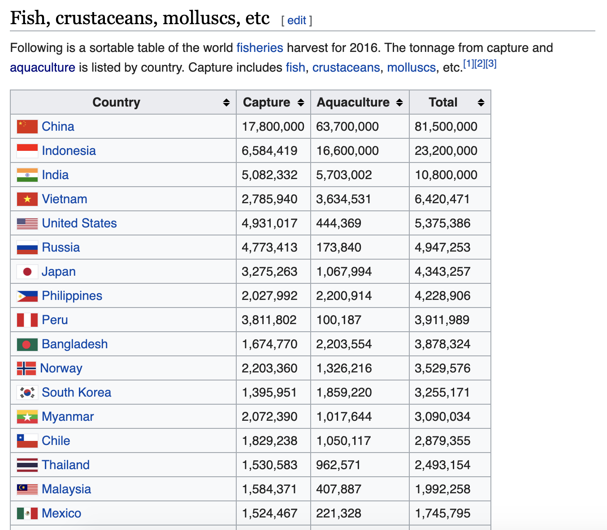

```{r setup, include=FALSE}
options(htmltools.dir.version = FALSE)
knitr::opts_chunk$set(echo = TRUE, fig.width = 5, fig.height = 3, dpi = 300)
```

```{r xaringan-themer, include = FALSE}
library(xaringanthemer)
mono_accent(
  base_color = "#0084A1",
  header_font_google = google_font("Raleway"),
  text_font_google   = google_font("Raleway", "300", "300i"),
  code_font_google   = google_font("Fira Code"),
  text_font_size     = "24px"
)
```

class: middle, center

# Fisheries of the world

---

Fisheries and Aquaculture Department of the Food and Agriculture Organization of 
the United Nations collects data on fisheries production of countries. The (not-so-great) visualization belows shows the distribution of fishery harvest 
of countries for 2016, by capture and aquaculture.  

<br>

.pull-left[
```{r echo=FALSE, out.width="100%", fig.align="center"}

```
]
.pull-right[
- Countries whose total harvest was less than 100,000 tons are not 
included in the visualization.
- Source: [Fishing industry by country](https://en.wikipedia.org/wiki/Fishing_industry_by_country)
]

---

.question[
What are some ways you would improve this visualization?
]

```{r echo=FALSE, out.width="60%", fig.align="center"}
knitr::include_graphics("img/fisheries.png")
```

--

- Calculate summary statistics at the continent level and visualize them.
- Map the data.

---

## Get the data

```{r message=FALSE}
library(tidyverse)
library(scales)
fisheries <- read_csv("data/fisheries.csv")
```

---

## Inspect the data

.midi[
```{r}
fisheries
```
]

---

## Data prep

Filter out countries whose total harvest was less than 100,000 tons since they 
are not included in the visualization:

```{r}
fisheries <- fisheries %>% filter(total > 100000)
fisheries
```

---

## Load continent data

```{r}
continents <- read_csv("data/continents.csv")
```

---

class: center, middle

# Data joins

---

.pull-left[
```{r}
fisheries %>% select(country)
```
]
.pull-right[
```{r}
continents
```
]

---

## Joining data frames

```
something_join(x, y)
```

- `inner_join()`: all rows from x where there are matching values in y, return 
all combination of multiple matches in the case of multiple matches
- `left_join()`: all rows from x
- `right_join()`: all rows from y
- `full_join()`: all rows from both x and y
- `anti_join()`: return all rows from x where there are not matching values in y, never duplicate rows of x
- ...
 
---

## Setup

For the next few slides...

.pull-left[
```{r echo=FALSE}
x <- tibble(value = c(1, 2, 3))
```
```{r}
x
```
]
.pull-right[
```{r echo=FALSE}
y <- tibble(value = c(1, 2, 4))
```
```{r}
y
```
]

---

## `inner_join()`

.pull-left[
```{r}
inner_join(x, y)
```
]
.pull-right[
```{r echo=FALSE}
knitr::include_graphics("img/inner-join.gif")
```
]

---

## `left_join()`

.pull-left[
```{r}
left_join(x, y)
```
]
.pull-right[
```{r echo=FALSE}
knitr::include_graphics("img/left-join.gif")
```
]

---

## `right_join()`

.pull-left[
```{r}
right_join(x, y)
```
]
.pull-right[
```{r echo=FALSE}
knitr::include_graphics("img/right-join.gif")
```
]

---

## `full_join()`

.pull-left[
```{r}
full_join(x, y)
```
]
.pull-right[
```{r echo=FALSE}
knitr::include_graphics("img/full-join.gif")
```
]

---

## `anti_join()`

.pull-left[
```{r}
anti_join(x, y)
```
]
.pull-right[
```{r echo=FALSE}
knitr::include_graphics("img/anti-join.gif")
```
]

---

.question[
We want to keep all rows and columns from `fisheries` and add a column for 
corresponding continents. Which join function should we use?
]

.pull-left[
```{r}
fisheries %>% select(country)
```
]
.pull-right[
```{r}
continents
```
]

---

## Join fisheries and continents 

```{r}
fisheries <- left_join(fisheries, continents) 
```

--

.question[
How does `left_join()` know to join the two data frames by `country`?
]

Hint:

- Variables in the original fisheries dataset:

```{r echo=FALSE}
fisheries %>% select(-continent) %>% names()
```

- Variables in the continents dataset:

```{r echo=FALSE}
names(continents)
```

---

## Check the data

```{r}
fisheries %>%
  filter(is.na(continent))
```

---

## Implement fixes

```{r}
fisheries <- fisheries %>%
  mutate(continent = case_when(
    country == "Democratic Republic of the Congo" ~ "Africa",
    country == "Hong Kong"                        ~ "Asia",
    country == "Myanmar"                          ~ "Asia",
    TRUE                                          ~ continent
    )
  )
```

--

...and check again

```{r}
fisheries %>%
  filter(is.na(continent))
```

---

.question[
What does the following code do?
]

```{r}
fisheries <- fisheries %>%
  mutate(aquaculture_perc = aquaculture / total)
```

---

## Continent-level statistics

```{r}
fisheries_summary <- fisheries %>%
  group_by(continent) %>%
  summarise(
    min_ap  = min(aquaculture_perc),
    mean_ap = mean(aquaculture_perc),
    max_ap  = max(aquaculture_perc)
  ) 

fisheries_summary
```

---

## Visualize continent summary stats

```{r fig.height=3,fig.width=7}
ggplot(fisheries_summary, aes(x = continent, y = mean_ap)) +
  geom_col()
```

---

## Improve visualization

```{r eval=FALSE}
ggplot(fisheries_summary, 
       aes(x = fct_reorder(continent, mean_ap), y = mean_ap)) + #<<
  geom_col() +
  coord_flip() +
  scale_y_continuous(labels = percent) + #<<
  labs(
    x = "", y = "",
    title = "Average share of aquaculture by continent",
    subtitle = "out of total fisheries harvest, 2016",
    caption = "Source: bit.ly/2VrawTt"
  ) +
  theme_minimal() #<<
```

---

```{r echo=FALSE}
ggplot(fisheries_summary, 
       aes(x = reorder(continent, mean_ap), y = mean_ap)) + #<<
  geom_col() +
  coord_flip() +
  scale_y_continuous(labels = percent) + #<<
  labs(
    x = "", y = "",
    title = "Average share of aquaculture by continent",
    subtitle = "out of total fisheries harvest, 2016",
    caption = "Source: bit.ly/2VrawTt"
  ) +
  theme_minimal() #<<
```

---

## Improve visualization further

```{r eval=FALSE}
ggplot(fisheries_summary, 
       aes(x = reorder(continent, mean_ap), y = mean_ap)) +
  geom_col() +
  coord_flip() +
  scale_y_continuous(labels = percent_format(accuracy = 1)) + #<<
  labs(
    x = "", y = "",
    title = "Average share of aquaculture by continent",
    subtitle = "out of total fisheries harvest, 2016",
    caption = "Source: bit.ly/2VrawTt"
  ) +
  theme_minimal()
```

---

```{r echo=FALSE}
ggplot(fisheries_summary, 
       aes(x = reorder(continent, mean_ap), y = mean_ap)) +
  geom_col() +
  coord_flip() +
  scale_y_continuous(labels = percent_format(accuracy = 1)) + #<<
  labs(
    x = "", y = "",
    title = "Average share of aquaculture by continent",
    subtitle = "out of total fisheries harvest, 2016",
    caption = "Source: bit.ly/2VrawTt"
  ) +
  theme_minimal()
```

---

class: center, middle

# Mapping

---

## Mapping the fisheries data

- Obtain country boundaries and store as a data frame
- Join the fisheries and country boundaries data frames
- Plot the country boundaries, and fill by fisheries harvest data

---

## `map_data()`

The `map_data()` function easily turns data from the maps package in to a data frame suitable for plotting with ggplot2:

```{r}
map_data("world")
```

---

# A few fixes for better matching

.question[
What does the following code do?
]

```{r}
world_map <- map_data("world") %>%
  mutate(region = case_when(
    region == "UK"           ~ "United Kingdom",
    region == "USA"          ~ "United States",
    subregion == "Hong Kong" ~ "Hong Kong",
    TRUE                     ~ region
    )
  )
```

---

## Map the world

.midi[
```{r fig.height=4.5, fig.width=12}
ggplot(world_map, aes(x = long, y = lat, group = group)) +
  geom_polygon(fill = "gray") +
  theme_minimal()
```
]

---

## Join fisheries and world map

.pull-left[
```{r}
fisheries %>% select(country)
```
]
.pull-right[
```{r}
world_map %>% select(region)
```
]

---

## Join fisheries and world map

```{r}
fisheries_map <- left_join(fisheries, world_map, 
                           by = c("country" = "region"))
```

```{r}
glimpse(fisheries_map)
```

---

## Mapping fisheries

.midi[
```{r fig.height=4.5, fig.width=12}
ggplot(fisheries_map, mapping = aes(x = long, y = lat, group = group)) +
  geom_polygon(aes(fill = capture)) +
  scale_fill_viridis_c() +
  theme_minimal()
```
]

---

.question[
What is misleading about the following map?
]

.midi[
```{r echo=FALSE, fig.height=6, fig.width=12, fig.align="center"}
ggplot(fisheries_map, mapping = aes(x = long, y = lat, group = group)) +
  geom_polygon(aes(fill = capture)) +
  scale_fill_viridis_c() +
  theme_minimal()
```
]

---

## Putting it altogether

```{r eval=FALSE}
ggplot() +
  geom_polygon(world_map, 
               mapping = aes(x = long, y = lat, group = group), 
               fill = "lightgray") + #<<
  geom_polygon(fisheries_map, 
               mapping = aes(x = long, y = lat, group = group, 
                             fill = capture)) + #<<
  scale_fill_viridis_c() +
  theme_minimal() +
  theme(legend.position = "bottom") +
  labs(
    x = "", y = "",
    title = "Fisheries harvest by capture, 2016",
    subtitle = "Capture measured in tonnes",
    caption = "Source: bit.ly/2VrawTt"
  )
```

---

```{r echo=FALSE, fig.height=6, fig.width=10, fig.align="center"}
ggplot() +
  geom_polygon(world_map, 
               mapping = aes(x = long, y = lat, group = group), 
               fill = "lightgray") +
  geom_polygon(fisheries_map, 
               mapping = aes(x = long, y = lat, group = group, 
                             fill = capture)) +
  scale_fill_viridis_c() +
  theme_minimal() +
  theme(legend.position = "bottom") +
  labs(
    x = "", y = "",
    title = "Fisheries harvest by capture, 2016",
    subtitle = "Capture measured in tonnes",
    caption = "Source: bit.ly/2VrawTt"
  )
```

---

## Log scale

```{r eval=FALSE}
ggplot() +
  geom_polygon(world_map, 
               mapping = aes(x = long, y = lat, group = group), 
               fill = "lightgray") +
  geom_polygon(fisheries_map, 
               mapping = aes(x = long, y = lat, group = group, 
                                            fill = log(capture))) + #<<
  scale_fill_viridis_c() +
  theme_minimal() +
  theme(legend.position = "bottom") +
  labs(
    x = "", y = "",
    title = "Fisheries harvest by capture, 2016",
    subtitle = "Capture measured in logged tonnes",
    caption = "Source: bit.ly/2VrawTt"
  )
```

---

## Log scale

```{r echo=FALSE, fig.height=6, fig.width=10, fig.align="center"}
ggplot() +
  geom_polygon(world_map, mapping = aes(x = long, y = lat, group = group), fill = "lightgray") +
  geom_polygon(fisheries_map, mapping = aes(x = long, y = lat, group = group, fill = log(capture))) +
  scale_fill_viridis_c() +
  theme_minimal() +
  theme(legend.position = "bottom") +
  labs(
    x = "", y = "",
    title = "Fisheries harvest by capture, 2016",
    subtitle = "Capture measured in logged tonnes",
    caption = "Source: bit.ly/2VrawTt"
  )
```

---

## Aquaculture

```{r eval=FALSE}
ggplot() +
  geom_polygon(world_map, 
               mapping = aes(x = long, y = lat, group = group), 
               fill = "lightgray") +
  geom_polygon(fisheries_map, 
               mapping = aes(x = long, y = lat, group = group, 
                             fill = log(aquaculture+1))) + #<<
  scale_fill_viridis_c() +
  theme_minimal() +
  theme(legend.position = "bottom") +
  labs(
    x = "", y = "",
    title = "Fisheries harvest by aquaculture, 2016",
    subtitle = "Aquaculture measured in logged tonnes",
    fill = "log(aquaculture)",
    caption = "Source: bit.ly/2VrawTt"
  )
```

---

```{r echo=FALSE, fig.height=6, fig.width=10, fig.align="center"}
ggplot() +
  geom_polygon(world_map, mapping = aes(x = long, y = lat, group = group), fill = "lightgray") +
  geom_polygon(fisheries_map, mapping = aes(x = long, y = lat, group = group, fill = log(aquaculture+1))) +
  scale_fill_viridis_c() +
  theme_minimal() +
  theme(legend.position = "bottom") +
  labs(
    x = "", y = "",
    title = "Fisheries harvest by aquaculture, 2016",
    subtitle = "Aquaculture measured in logged tonnes",
    fill = "log(aquaculture)",
    caption = "Source: bit.ly/2VrawTt"
  )
```

---

```{r echo=FALSE, fig.height=6, fig.width=10, fig.align="center"}
fisheries_map <- fisheries_map %>%
  mutate(
    aquaculture_perc = aquaculture / total
  )

ggplot() +
  geom_polygon(world_map, 
               mapping = aes(x = long, y = lat, group = group), 
               fill = "lightgray") +
  geom_polygon(fisheries_map, 
               mapping = aes(x = long, y = lat, group = group, 
                             fill = aquaculture_perc)) +
  scale_fill_viridis_c(labels = percent_format(accuracy = 1)) +
  theme_minimal() +
  theme(legend.position = "bottom", legend.key.width = unit(2, "lines")) +
  labs(
    x = "", y = "",
    title = "Average share of aquaculture by country",
    subtitle = "out of total fisheries harvest, 2016",
    caption = "Source: bit.ly/2VrawTt",
    fill = "Aquaculture %"
  )
```

---

class: center, middle

# Instructional staff employment trends

---

The American Association of 
University Professors (AAUP) is a nonprofit membership association of faculty 
and other academic professionals. 
[This report](https://www.aaup.org/sites/default/files/files/AAUP_Report_InstrStaff-75-11_apr2013.pdf) 
by the AAUP shows trends in instructional staff employees between 1975 
and 2011, and contains an image very similar to the one given below.

```{r echo=FALSE,out.width="80%",fig.align="center"}
knitr::include_graphics("img/staff-employment.png")
```

---

## Data

Each row in this dataset represents a faculty type, and the columns are the 
years for which we have data. The values are percentage of hires of that type 
of faculty for each year.

```{r load-data-staff, message=FALSE}
staff <- read_csv("data/instructional-staff.csv")
staff
```

---

## Recreate the visualization

In order to recreate this visualization we need to first reshape the data to have 
one variable for faculty type and one variable for year. In other words, 
we will convert the data from the long format to wide format. 

But before we do so... 

.question[
If the long data will have a row for each year/faculty type combination, 
and there are 5 faculty types and 11 years of data, how many rows will the data have?
]

---

## Pivot staff data

.midi[
```{r}
staff_long <- staff %>%
  pivot_longer(cols = -faculty_type, names_to = "year", 
               values_to = "percentage") %>%
  mutate(percentage = as.numeric(percentage))

staff_long
```
]

---

.question[
This doesn't look quite right, how would you fix it?
]

.small[
```{r fig.height=2}
staff_long %>%
  ggplot(aes(x = year, y = percentage, color = faculty_type)) +
  geom_col(position = "dodge") + 
  coord_flip()
```
]

---

.midi[
```{r fig.height=2}
staff_long %>%
  ggplot(aes(x = year, y = percentage, fill = faculty_type)) +
  geom_col(position = "dodge") + 
  coord_flip()
```
]

---

## Some improvement...

.midi[
```{r fig.height=2}
staff_long %>%
  ggplot(aes(x = year, y = percentage, fill = faculty_type)) +
  geom_col() +
  coord_flip()
```
]

---

## More improvement

.midi[
```{r fig.width=7}
staff_long %>%
  ggplot(aes(x = year, y = percentage, group = faculty_type, color = faculty_type)) +
  geom_line() +
  theme_minimal()
```
]

---

.midi[
```{r fig.width=7, fig.height=4, echo=FALSE}
staff_long %>%
  mutate(part_time = if_else(faculty_type == "Part-Time Faculty", "Part-Time Faculty", "Other Faculty")) %>%
  ggplot(aes(x = year, y = percentage/100, group = faculty_type, 
             color = part_time)) +
  geom_line() +
  scale_color_manual(values = c("gray", "red")) +
  scale_y_continuous(labels = percent_format(accuracy = 1)) +
  theme_minimal() +
  labs(
    title = "Instructional staff employment trends",
    x = "Year",
    y = "Percentage",
    color = ""
  ) +
  theme(legend.position = "bottom")
```
]

---

.midi[
```{r eval=FALSE}
staff_long %>%
  mutate(part_time = 
           if_else(faculty_type == "Part-Time Faculty", 
                   "Part-Time Faculty", "Other Faculty")) %>%
  ggplot(aes(x = year, y = percentage/100, group = faculty_type, 
             color = part_time)) +
  geom_line() +
  scale_color_manual(values = c("gray", "red")) +
  scale_y_continuous(labels = percent_format(accuracy = 1)) +
  theme_minimal() +
  labs(
    title = "Instructional staff employment trends",
    x = "Year",
    y = "Percentage",
    color = ""
  ) +
  theme(legend.position = "bottom")
```
]
