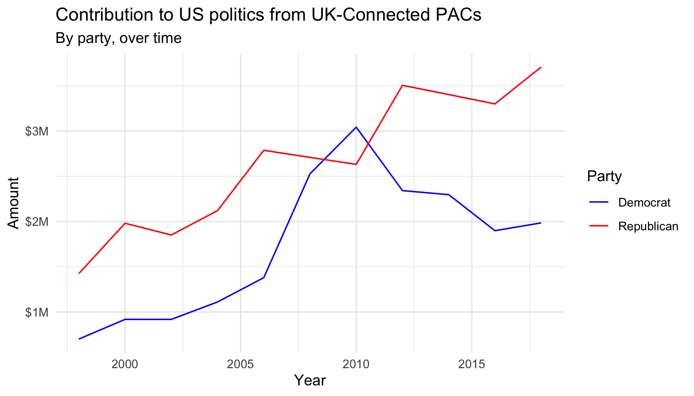

```{r child = "../../setup.Rmd"}
```

.your-turn[
Design an assignment on RStudio Cloud!
]

---

## Some guidance...

- Decide whether you want to design it as a single project or as an assignment in a workspace -- think about pros/cons, your use case, etc.
- Pre-install packages for the students
- Create a template R Markdown file where their data analysis result will be presented
- Think about whether they will need other files (e.g. scripts) and folders, if so, create them
- Write the instructions for the assignment in a README.md or README.Rmd file in the project
- You can choose to create everything in RStudio Cloud or create them locally and upload / clone from Git

---

## Need inspiration?

- Option 1: Take a sad plot and make it better

- Option 2: Scrape and visualise

---

### Take a sad plot and make it better

## Fisheries of the world

- Improve the visualisation shown below
- Data can be found [here](../../data/fisheries.csv)
- Potential avenues: continent level analysis or mapping

```{r echo=FALSE, fig.align="center", out.width="70%"}
knitr::include_graphics("img/fisheries.png")
```

---

### Scrape and visualise

## Foreign connected PAC $ to US politics

- Scrape and visualise data from [here](https://www.opensecrets.org/political-action-committees-pacs/foreign-connected-pacs)

- Iterate the scraping process for all years and recreate the following plot

```{r echo=FALSE, fig.align="center", out.width="60%"}

```

---

.your-turn[
Design an assignment on RStudio Cloud!

When you're done, compare notes. Better yet, work together with your neighbor throughout and run ideas by course staff.
]

```{r echo=FALSE}
countdown(minutes = 20)
```
