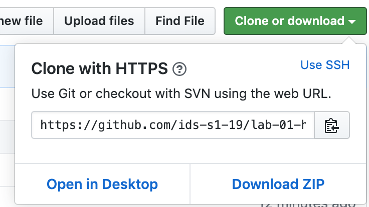

```{r setup, include=FALSE}
library(here)
```

```{r grassmarket, echo = FALSE, out.width="30%", out.extra='style="float:right; padding:10px"'}
knitr::include_graphics("img/madeleine-kohler-90Qn643Pq9c-unsplash.jpg")
```

Recent development in Edinburgh regarding the growth of Airbnb and its impact on the housing market means a better understanding of the Airbnb listings is needed. Using data provided by Airbnb, we can explore how Airbnb availability and prices vary by neighborhood.

The data come from the [Kaggle database](https://www.kaggle.com/thoroc/edinburgh-inside-airbnb/version/2). It's 
been modified to better serve the goals of this exploration.

## Learning goals

The goal of this assignment is not to conduct a thorough analysis of Airbnb listings in Edinburgh, but instead to give you another chance to practice your workflow, data visualization, and interpretation skills.

## Getting help

If you have any questions about the assignment, please post them on Piazza!

## Getting started

The next few steps will walk you through the process of getting information of the repo to be cloned, launching RStudio, and cloning your repo, and getting started with the analysis.

### 1. Get URL of repo to be cloned

```{r clone-repo-link, fig.margin = TRUE, echo = FALSE, fig.width=3}

```

On GitHub, click on the green **Clone or download** button, select **Use HTTPS** (this might already be selected by default, and if it is, you'll see the text **Clone with HTTPS** as in the image below). Click on the clipboard icon to copy the repo URL.

### 2. Launch RStudio

Go to the RStudio Cloud workspace for the course ([rstd.io/design-ds-cloud](https://rstd.io/design-ds-cloud)). Click on New Project from Git, and paste the URL of your repo you just copied here. And voila!

### 3. Get working!

Read the instructions for your assignment in your repo's README and complete your work in the R Markdown (Rmd) file called `hw-01-airbnb-edi.Rmd`.

## Hello Git!

```{marginfigure}
Your email address is the address tied to your GitHub account and your name should be first and last name.
```

Before we can get started we need to take care of some required housekeeping. Specifically,  we need to do some configuration so that RStudio can communicate with GitHub. This requires two pieces of information: your email address and your name.

Run the following (but update it for your name and email!) in the Console to configure git:

```{r git-config, eval=FALSE}
use_git_config(user.name = "Your Name", 
               user.email = "your.email@address.com")
``` 

## Warm up

Before we introduce the data, let's warm up with some simple exercises.

```{marginfigure}
The top portion of your R Markdown file (between the three dashed lines) is called YAML. It stands for "YAML Ain't Markup Language". It is a human friendly data serialization standard for all programming languages. All you need to know is that this area is called the YAML (we will refer to it as such) and that it contains meta information about your document.
```

### YAML

Open the R Markdown (Rmd) file in your project, change the author name to your name, and knit the document.

### Commit

Then Go to the Git pane in your RStudio.

If you have made changes to your Rmd file, you should see it listed here. Click on it to select it in this list and then click on **Diff**. This shows you the *diff*erence between the last committed state of the document and its current state that includes your changes. If you're happy with these changes, write "Update author name" in the **Commit message** box and hit **Commit**.

```{r update-author-name-commit, fig.fullwidth=TRUE, echo = FALSE}
knitr::include_graphics("img/update-author-name-commit.png")
```

You don't have to commit after every change, this would get quite cumbersome. You should consider committing states that are *meaningful to you* for inspection, comparison, or restoration. In the first few assignments we will tell you exactly when to commit and in some cases, what commit message to use. As the semester progresses we will let you make these decisions.

### Push

Now that you have made an update and committed this change, it's time to push these changes to the web! Or more specifically, to your repo on GitHub. Why? So that others can see your changes. And by others, we mean the course teaching team (your repos in this course are private to you and us, only). 

In order to push your changes to GitHub, click on **Push**. This will prompt a dialogue box where you first need to enter your user name, and then your password. This might feel cumbersome. Bear with me... We *will* teach you how to save your password so you don't have to enter it every time. But for this one assignment you'll have to manually enter each time you push in order to gain some experience with it.

First, open the R Markdown document `hw-01-airbnb-edi.Rmd` and Knit it. Make sure it compiles without errors. The output will be in the file markdown `.md` file with the same name.

## Packages

We'll use the **tidyverse** package for this analysis. Run the following code in the Console to load this package.

```{r load-packages, message=FALSE}
library(tidyverse)
```

## Data

The data is in a CSV (comma separated values) file called `listings.csv` in the `data/` folder in your repository. You can load this file into R using the `read_csv()` function.

```{r message=FALSE}
listings <- read_csv("data/listings.csv")
```

1. Load the data in the Console with the code above, and observe that an object called `listings` has been added to your environment (in the Environment tab) in the top right. Click on this object to view the data in the data viewer. What does each row in the dataset represent?

```
Hint: The Markdown Quick Reference sheet has an example of inline R code that might be helpful. You can access it from the Help menu in RStudio.
```

2. How many observations (rows) does the dataset have? Instead of hard coding the number in your answer, use inline code. 

`r emo::ji("white_check_mark")` `r emo::ji("arrow_up")` *Now is a good time to commit and push your changes to GitHub with an appropriate commit message. Make sure to commit and push all changed files so that your Git pane is cleared up afterwards.*

Each column represents a variable. We can get a list of the variables in the data frame using the `names()` function.

```{r}
names(listings)
```

The variables and their descriptions are given below:

- `id`: ID number of the listing
- `price`: Price, in GBP, for one night stay
- `neighbourhood`: Neighbourhood listing is located in
- `accommodates`: Number of people listing accomodates
- `bathrooms`: Number of bathrooms
- `bedrooms`: Number of bedrooms
- `beds`: Number of beds (which can be different than the number of bedrooms)
- `review_scores_rating`: Average rating of property
- `number_of_reviews`: Number of reviews
- `listing_url`: Listing URL

```
Note: The plot will give a warning about some observations with non-finite values for price being removed. Don't worry about the warning, it simply means that 199 listings in the data didn't have prices available, so they can't be plotted.
```

3. Create a faceted histogram where each facet represents a neighborhood and displays the distribution of Airbnb prices in that neighborhood. Sample code is provided below, but you will need to fill in the blanks.

```{r eval=FALSE}
ggplot(data = ___, mapping = aes(x = ___)) +
  geom_histogram(binwidth = ___) +
  facet_wrap(~___)
```

Let's desconstruct this code: 

- `ggplot()` is the function we are using to build our plot, in layers.
- In the first layer we always define the data frame as the first argument. Then, we define the mappings between the variables in the dataset and the **aes**thetics of the plot (e.g. x and y coordinates, colors, etc.). 
- In the next layer we represent the data with **geom**etric shapes, in this case with a histogram. You should decide what makes a reasonable bin width for the histogram by trying out a few options.
- In the final layer we facet the data by neighbourhood.

`r emo::ji("white_check_mark")` `r emo::ji("arrow_up")` *Commit and push your changes again.*

4. Create a similar visualization, this time showing the distribution of review scores (`review_scores_rating`) across neighborhoods. In your answer, include a brief interpretation of how Airbnb guests rate properties in general and how the neighborhoods compare to each other in terms of their ratings.

`r emo::ji("white_check_mark")` `r emo::ji("arrow_up")` *Commit and push your changes again.*
