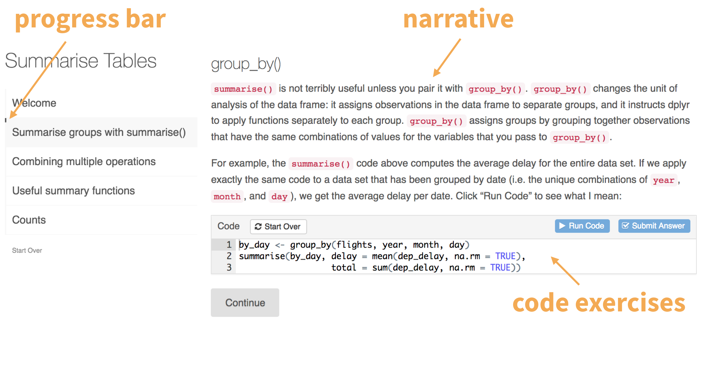

```{r child = "../../setup.Rmd"}
```


class: middle, inverse

# What?

---

```{r echo=FALSE}

```

---

class: middle, inverse

# Why?

---

## Within a course

- Flipped classroom:
  - Assign a learnr tutorial, including narrative and implementation in R that students can practice with, before introducing a concept in class
  - Cover the concept in class (quicker)
  - Allocate the time saved to hands on exercises in class
- Lecture follow-up
  - Provide the same content from the lecture as follow up exercises
- Lab exercises / assignments

---

## Self learning

- Learn by doing
- Package tutorials
- Workshop follow ups

---

class: middle, inverse

# How?

---

## Getting started

Follow along options:

- Local: 
  - In RStudio, install and load the **learnr** and **sortable** packages
  - File ➝ New File ➝ R Markdown… ➝  From template ➝ Interactive Tutorial

- Cloud: Go to the workspace for this course and start the assignment called **07 - Learnr**.

- Deployed tutorial: https://gallery.shinyapps.io/tutorial-demo/

---

## Sharing with students

- You could share the R Markdown (and all accompanying files) but that’s probably not what you want to do…

- Deploy on
  - shinapps.io
  - RStudio Connect (free for academic use)
  
---

class: middle, inverse

# How else?

---

## Code checking

- No built in code checking feature, but hooks for using other packages for code checking

- **gradethis** is furthest along: https://github.com/rstudio-education/gradethis
  
---

## Recording events

- Recording events like exercise and question submissions, requests for hints/solutions, etc.
- This is possible with learnr, though not very simple
- With other R tools that allow for writing out to spreadsheets (e.g. Google Sheets)  and building dashboards (e.g. shinydashboard) it’s possible to build a dashboard for your class where you can track their progress and learn from what they’re struggling with

---

## A simpler hack: "Minute paper"

Add a link at the end of your tutorial to a Google (or other) form

- *Write about one or two questions you didn't get right initially but were able to solve after a few tries. What was difficult about them? What did you ultimately learn?*

OR

- *If you got every single question correct on the first try, write one question you would still like clarified on the topics covered in this quiz.*

---

.your-turn[
Create a tutorial with three questions: one multiple choice, one code, and one sortable / parsons question. It's of course ok if each question requires some code, but this is not required.

**Stretch goal:** Deploy the tutorial on shinyapps.io. See https://rstudio.github.io/learnr/publishing.html for more on this.

**Tip:** Start with the demo I provided and add / remove as you wish.

]