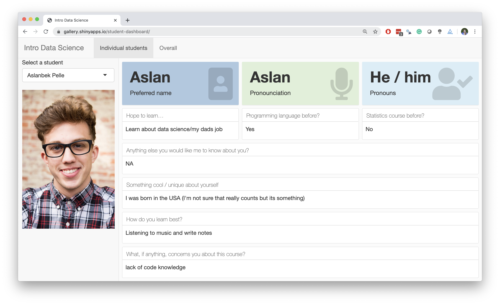
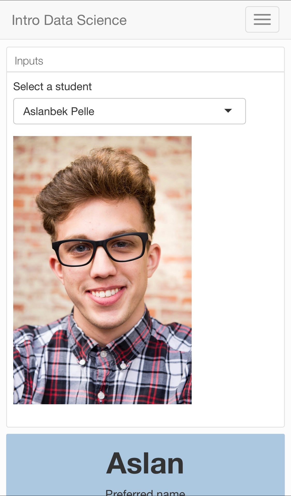

```{r child = "../../setup.Rmd"}
```

class: middle, inverse

# Student dashboard

---

## Get to know your students better

with the help of **flexdashboard**...

```{r echo=FALSE, out.width="40%", fig.align="center"}

```

.center[
[gallery.shinyapps.io/student-dashboard](https://gallery.shinyapps.io/student-dashboard/)
]

Collect info from students at the beginning of course using (Google) forms > Save data as CSV > Build dashboard > Tweak to your heart's desire

---

class: middle, center

.pull-left[
.hand[ While waiting for class to begin... ]
]
.pull-right[
```{r echo=FALSE, out.width="60%"}

```
]

---

## Student dashboard resources

- Code: https://github.com/rstudio-conf-2020/design-ds-classroom/tree/master/materials/08-lifehacks/student-dashboard
- Deployed app: https://gallery.shinyapps.io/student-dashboard/
- Form: https://forms.gle/La4UfDjNLkyKR45B9

---

class: middle, inverse

# Blogdown

---

## Build your course website with blogdown

- Work natively with Rmd files
- Embed R code throughout website
- Automate all the things with Netlify
- Example: http://introds.org/
  - Each week / module as a "blog post": https://github.com/ids-s1-19/website/tree/master/content/post
  - Source code: https://github.com/ids-s1-19/website
- Resources:
  - Summer of blogdown: https://summer-of-blogdown.netlify.com/
  - Blogdown book: https://bookdown.org/yihui/blogdown/
  
---

class: middle, inverse

# Accessibility

---

## Check for accessibility within your browser

Axe plugin is pretty nifty:

- [Chrome](https://chrome.google.com/webstore/detail/axe-web-accessibility-tes/lhdoppojpmngadmnindnejefpokejbdd?hl=en-US)
- [Firefox](https://addons.mozilla.org/en-US/firefox/addon/axe-devtools/)

---

## And a few more...

- Addins to make your life easier
- `r emo::ji("parcel")` searcher: https://github.com/r-assist/searcher
- `r emo::ji("parcel")` livecode: https://github.com/rundel/livecode


